# IMS — Detailed PRD with Page Processes & Flows / 详细产品需求文档（含每页流程与流程图）

> Generated: 2026-06-09 · Companion to [PRD.md](PRD.md) (overview), [FILE_STRUCTURE.md](FILE_STRUCTURE.md), [CODE_DUPLICATION_REPORT_EN.md](CODE_DUPLICATION_REPORT_EN.md)
> This document lists **the step-by-step process of each page type** and draws **flow diagrams** (Mermaid — renders in VS Code Markdown preview & GitHub).
> Because ~250 of the pages follow the **same reusable patterns**, those are documented once in **Part B** (and apply to every CRUD page). Complex/unique pages are documented individually in **Part C**.

---

## How to read this doc / 阅读说明
- **Part A** — system-wide flows (login, permission, page bootstrap).
- **Part B** — generic page processes (List / Add-Edit / Delete / Export / Import). These cover most entity pages (`brand`, `product`, `courier`, `currencies`, … the whole CRUD family).
- **Part C** — detailed process for the complex business pages (orders, shipping, import, verify, finance, follow-up, warehouse scan).
- **Part D** — cron / automation flows.
- Mermaid diagrams won't render in a plain text editor — open in **VS Code preview (Ctrl+Shift+V)** or GitHub.

---

# PART A — System-wide Flows / 系统级流程

## A0. System context map / 系统上下文

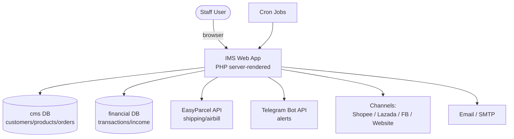

## A1. Login / Authentication process / 登录流程

**Page**: `login.php` (posted from `index.php` form). Source-verified.

**Process / 步骤**:
1. Receive `email` + `password`; password hashed with `md5()`.
2. Query active user: `SELECT * FROM usr_user WHERE email=? AND status='A'`.
3. If no exact 1 match → redirect `index.php?err=1` (invalid user).
4. If `fail_count == 4` → redirect `index.php?err=3` (**account locked**).
5. If stored password ≠ submitted → `fail_count + 1`, redirect `index.php?err=2` (wrong password).
6. On success → reset `fail_count = 0`.
7. Load session: `userid`, `user_name`, `user_email`, `user_group`.
8. Read the user's group `pins` string, parse into **PIN access map** → `$_SESSION['usr_pin']` and `$_SESSION['usr_pin_access']` (page → allowed actions).
9. Set "remember me" cookie (`cmsSetAutoLoginCookieForUserRow`).
10. Write `audit_log` (login event).
11. **Warm JSON cache**: `generateDBData()` for ~24 lookup tables (brands, products, couriers, accounts, etc.) for fast client-side lookups.
12. Redirect → `dashboard.php`.

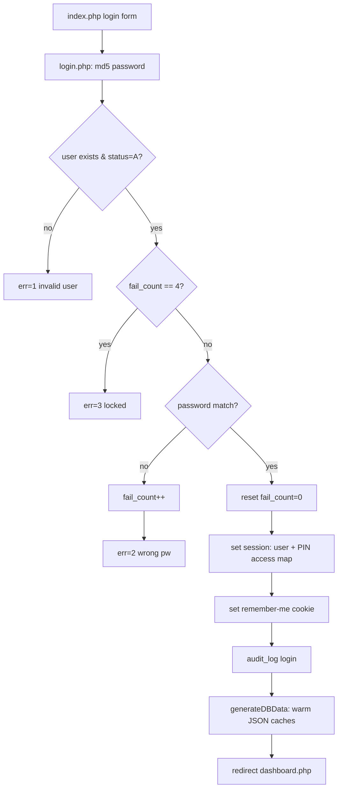

> Related: `forgotPassword.php` → emails token → `changePassword.php?token=&email=` (token-gated, bypasses normal login guard). `include/auto_login.php` restores session from cookie when `$_SESSION['userid']` is missing.

## A2. Per-page bootstrap & permission gate / 每页引导与权限校验

Every authenticated page runs the **same bootstrap chain** before rendering:

**Process**:
1. Page sets `$pageTitle` and `$currentPagePin = N`.
2. `include 'menuHeader.php'` → loads `init.php` (config/DB/constants), `include/common.php` (functions), session-alert bell, top menu (menu items filtered by the user's PIN access).
3. `include 'checkCurrentPagePin.php'` + `include/access.php`:
   - If user's `usr_pin_access` contains `$currentPagePin` → load that page's allowed action keys.
   - Else (and PIN ≠ dashboard) → **redirect to `dashboard.php`** (no access).
4. `$pinAccess = checkCurrentPin(...)` → resolve allowed actions for this page.
5. Each button/feature wrapped in `isActionAllowed("Add"/"View"/"Edit"/"Delete"/"Export"/"Search"/"Reset", $pinAccess)`.

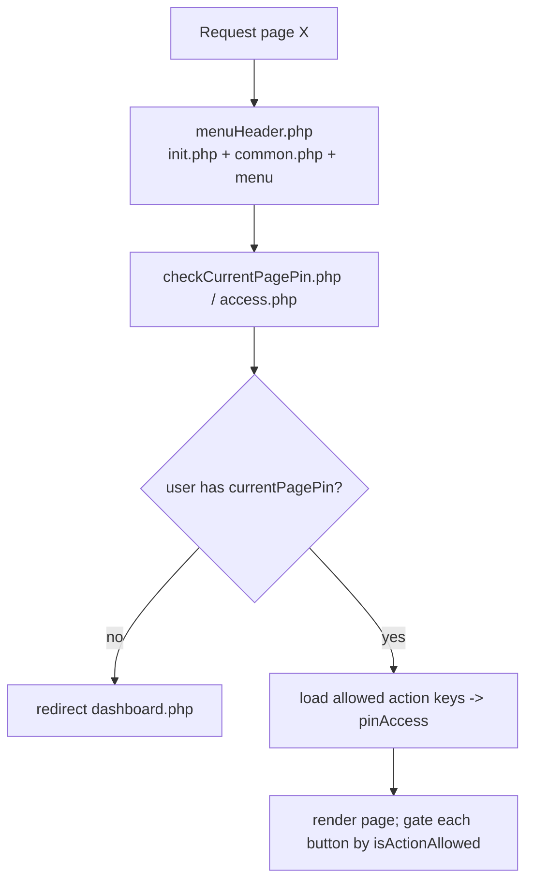

---

# PART B — Generic Page Processes / 通用页面流程（覆盖大多数 CRUD 页面）

> These patterns apply to the entire entity family: `brand`, `product`, `package`, `courier`, `currencies`, `cus_level`, `holiday`, `platform`, `user`, … (the `X.php` + `X_table.php` pairs). Verified against `brand.php` / `brand_table.php` / `recordDelete.php`.

## B1. List page process — `X_table.php` / 列表页

**Process**:
1. Bootstrap + permission gate (Part A2).
2. Resolve `$pageTitle` via `getPinGroupNameById()`.
3. Reset session work flags: `act`, `viewChk`, `delChk`, `expChk`, `searchChk`.
4. Set `$redirect_page = SITEURL/X.php` (form) and `$deleteRedirectPage = SITEURL/X_table.php`.
5. Fetch rows: `getData('*', '', '', $tblName, $connect)` (only `status != 'D'`).
6. On query failure → alert "network temporary fail" → redirect `dashboard.php`.
7. Render DataTable (`createSortingTable('table')`) with per-row buttons:
   - **Add** (if allowed) → `X.php?act=I`
   - **View** → `X.php?act=V&id=...` (renderViewEditButton)
   - **Edit** → `X.php?act=E&id=...`
   - **Delete** → `renderDeleteButton(...)` (confirm → `X.php?act=D&id=...`)
   - **Export** (if allowed) → Excel/ZIP (see B4)

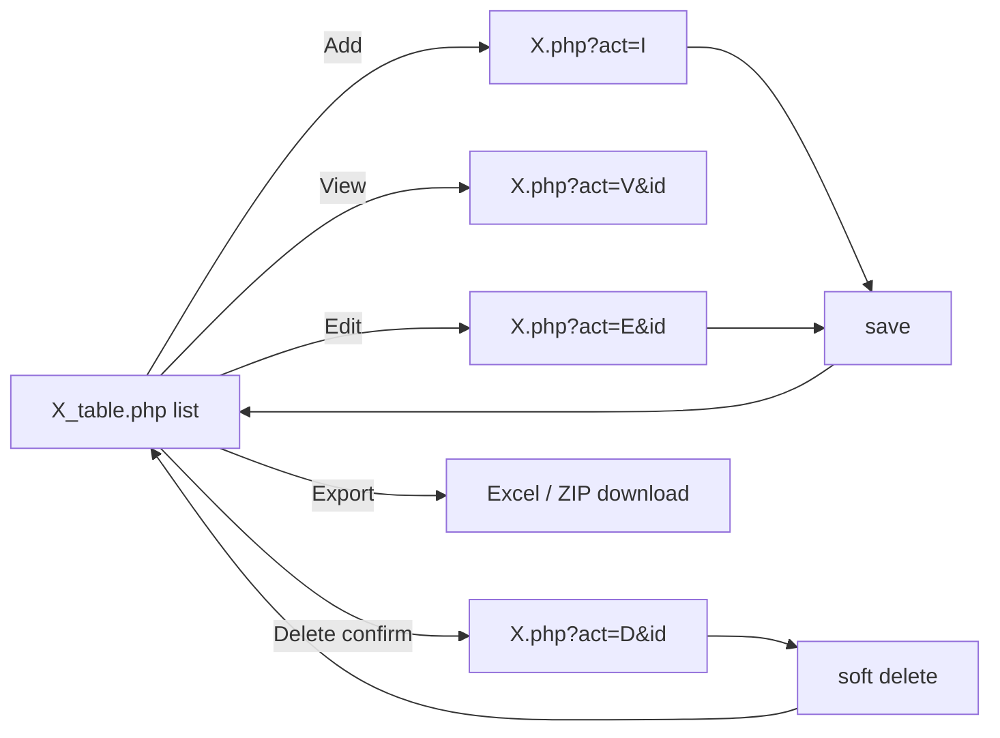

## B2. Add / Edit form process — `X.php` / 新增·编辑表单

**Process** (verified against `brand.php`):
1. Read `act` (I/E/V/D) and `id`; validate `id` is numeric.
2. Permission check `isActionAllowed(pageAction)`; if not allowed or bad params → redirect to `X_table.php`.
3. If `id` present → `getData('*', "id=?", ...)` to prefill; load related dropdown options (e.g. company list).
4. **View** (`id` & no act): write `viewChk` + audit "viewed".
5. **Delete** (`act=D`): call `deleteRecord()` (soft delete) + set `delChk`.
6. **On POST** with `actionBtn`:
   - `back` → return to list (no save).
   - `addData` → validate (e.g. duplicate-name check) → `INSERT INTO X (...fields, create_by, create_date, create_time)` → audit "add".
   - `updData` → validate → `UPDATE X SET ...fields, update_by/date/time WHERE id=?` → audit "update".
   - On POST validation error → re-render form retaining typed input.
7. After successful save → redirect to `X_table.php`.

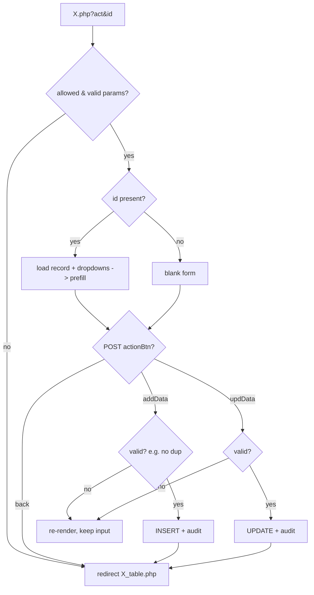

## B3. Delete process / 删除（软删除）

**Process** (`recordDelete.php → deleteRecord()`):
1. `UPDATE tbl SET status='D' WHERE idType = id` — **soft delete** (records are never physically removed).
2. Write `audit_log` ("deleted" or "failed to delete" with the query).
3. Redirect back to the list. Deleted rows are excluded by `getData()` because it filters `status != 'D'`.

## B4. Export process (Excel / ZIP) / 导出

**Process** (pattern across finance/shopee `_table.php`):
1. User clicks Export (gated by `isActionAllowed("Export")`).
2. Build a temp dir; generate `.xlsx` (PhpXlsxGenerator) and/or attachments.
3. Zip the dir via `addDirToZip()`; stream with `Content-Disposition: attachment`.
4. Clean up temp dir via `deleteDir()`.
5. (Some pages) record `auditExport()`.

> ⚠️ `deleteDir`/`addDirToZip` are currently copy-pasted into 50 files — see duplication report item 1.

## B5. Import process — `X_import.php` / 批量导入

**Process** (pattern across `*_import.php`, incl. PDF airbill imports):
1. Upload file (Excel or PDF).
2. **Parse**: for Excel → read rows; for PDF → `extractTextFromPdfContent()` → `getPdfTextLines()` → field extraction (airbill code, recipient, address).
3. **Normalize & match** (`normalizeImportText`, `normalizeImportLookup`) against existing master data.
4. **Preview** the parsed rows for the user to confirm / fix mappings.
5. On confirm → INSERT/UPDATE records + audit.

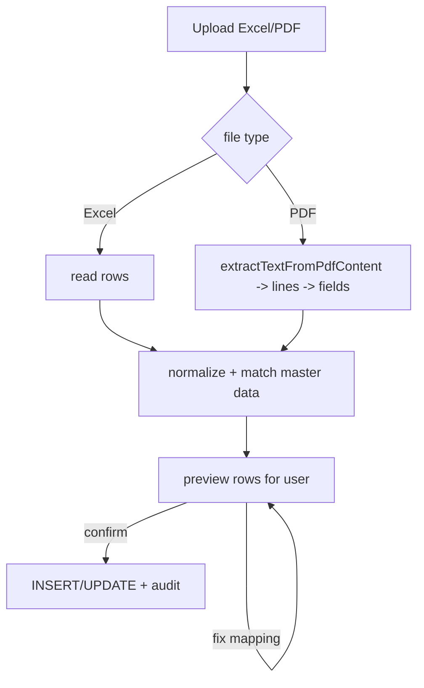

---

# PART C — Complex Page Processes / 复杂业务页面流程

## C1. Make Order + Shipping — `make_order.php` (+ `rate_checking.php`) / 下单与运单

**Purpose**: create a shipment/order and book an airbill via EasyParcel. Verified from source (`case 'makeOrder'`).

**Process**:
1. User reaches `make_order.php` from `rate_checking.php?country=MY/SG` (after checking a shipping rate).
2. Fill form `makeOrderForm`: sender/recipient details, parcel value/weight/content, courier, pickup vs dropoff, pickup date/time.
3. On `actionBtn=makeOrder`:
   - Resolve country (MY/SG) → choose EasyParcel domain + auth.
   - If courier not in DB → `INSERT INTO courier`.
   - `INSERT INTO customer` (recipient) if new.
   - Call EasyParcel to book → obtain AWB (airbill number).
   - `INSERT INTO ship_request` (order_no, customer, courier, awb, cost, weight, pickup, …).
4. `back` → return to `rate_checking.php?country=...`.

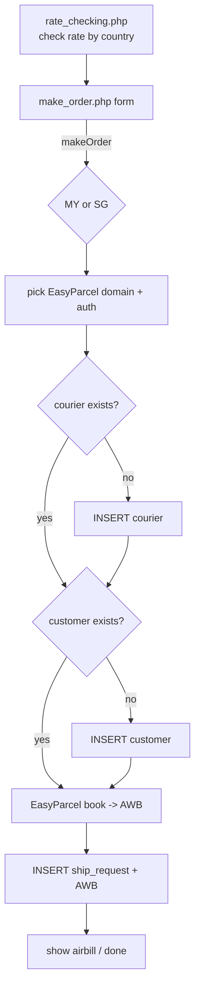

## C2. Channel Order Lifecycle / 渠道订单生命周期（端到端）

Applies to Shopee / Lazada / Facebook / Website (each has its own `*_order_req` pages but the same lifecycle).

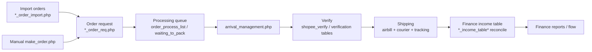

## C3. Shopee Order Import — `shopee_order_import.php` / Shopee 订单导入

**Purpose**: import Shopee orders (and airbill PDFs) into the system. (248 KB page; PDF-parsing helpers shared with `shopee/shopee_order_req.php` and `include/common.php`.)

**Process**:
1. Upload Shopee export (Excel) and/or airbill PDFs.
2. PDF path: `extractShopeeAirbillDataFromPdfItems()` → pull AWB, recipient name/address.
3. Normalize & match products/customers/accounts.
4. Preview → user confirms.
5. Create/Update Shopee order requests; link airbill data.
6. Audit + downstream into the lifecycle (C2).

## C4. Shopee Verify / Processing — `shopee/shopee_verify.php`, `shopee_processing_order.php`, `shopee_order_verification_table.php`

**Purpose**: operational verification before shipping/finance.

**Process**:
1. List orders with **filters/grouping** (`applyFilterOrGroup`, `toggleFilters`, `autoToggleSections`).
2. For each order, optionally set **estimated received date** via modal (`openEstimatedReceivedDateModal`).
3. Verify action (POST form) → mark order verified → flows to `shopee_finance_verified_table.php` and income reconciliation.

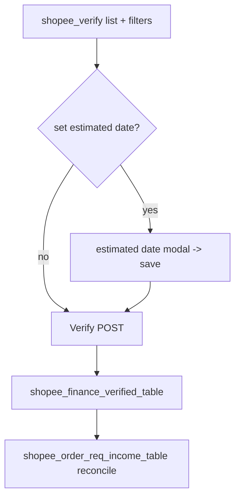

## C5. Warehouse Stock-In Scan — `warehouse_stock_in_scan.php` / 仓库扫描入库

**Purpose**: barcode-driven inbound stock with attachment capture & integrity checks. Verified (functions `scanSaveOrderSecure`, IP/country checks, attachment upload).

**Process**:
1. Scan/enter package label → resolve warehouse package.
2. Attach photos/files (`scanUploadAttachmentFiles`, add/remove rows, live `refreshPreview`).
3. Security checks: client IP → country allow-list (`scanGetClientIp` / `scanLookupCountryCode`), trusted attachment-path validation.
4. `scanSaveOrderSecure()` → save stock-in order + items + attachment, set `update_by/date/time`.
5. Audit.

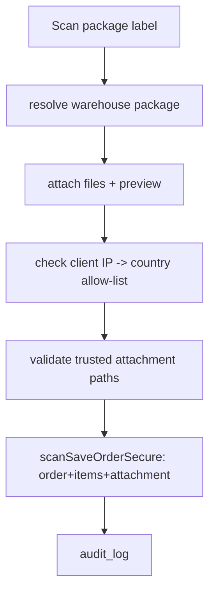

## C6. Finance Income Reconciliation — `*_income_table(.php/_detail/_summary)` / 财务收入对账

**Purpose**: reconcile per-channel order income; three coordinated views.

**Process**:
1. **`_table.php`** — main reconciliation list: filter by date/channel/account; bulk-select across pages (`updateCheckboxesOnOtherPages`); export.
2. **`_detail.php`** — line-level breakdown for a record.
3. **`_summary.php`** — aggregated totals (per period/account).
4. Verified/matched income rows feed finance reports (`flow_report.php`).

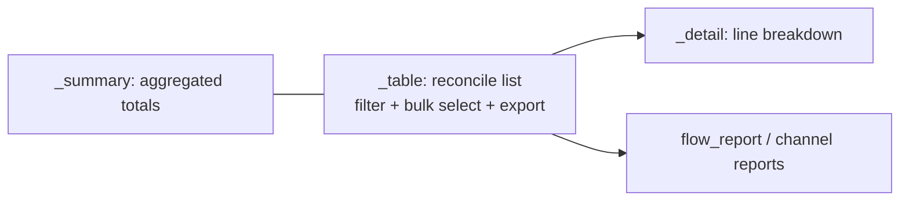

## C7. Customer Follow-up — `customer_follow_up_list.php` (+ `include/customer_follow_up_common.php`) / 客户跟进

**Purpose**: sales follow-up pipeline driven by status + crons.

**Process**:
1. List customers with follow-up status (due / upcoming / missed / lost).
2. Staff log a follow-up action / next-contact date / notes (message shortcuts available).
3. Status auto-transitions via crons:
   - `cron_customer_follow_up_due.php` → flag due today.
   - `cron_customer_follow_up_missed.php` → mark missed (past due, no action).
   - `cron_customer_follow_up_lost.php` → mark lost (long inactive).

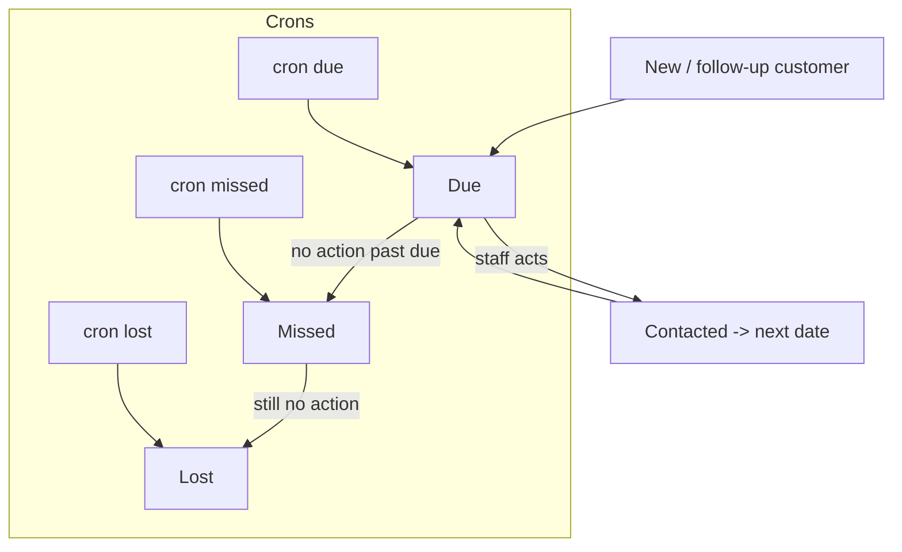

## C8. System Alerts / Notifications — `system_alert_*` (+ `include/system_alert_common.php`)

**Process**:
1. On each page load (`menuHeader.php`), `systemAlertGenerateForUser()` builds alerts for the current user.
2. Bell shows unread count; `system_alert_live.php` polls for live updates.
3. Clicking an alert → action/redirect (`system_alert_action.php`); marks read.
4. `cron_system_alert_message.php` generates scheduled alert messages.

## C9. Dashboard — `dashboard.php`

**Process**:
1. Bootstrap + permission (PIN 7 = dashboard, always allowed).
2. Query KPIs across cms + financial DBs.
3. Render panels & charts (Chart.js). Entry point for all navigation.

---

# PART D — Automation / Cron Flows / 定时任务流程

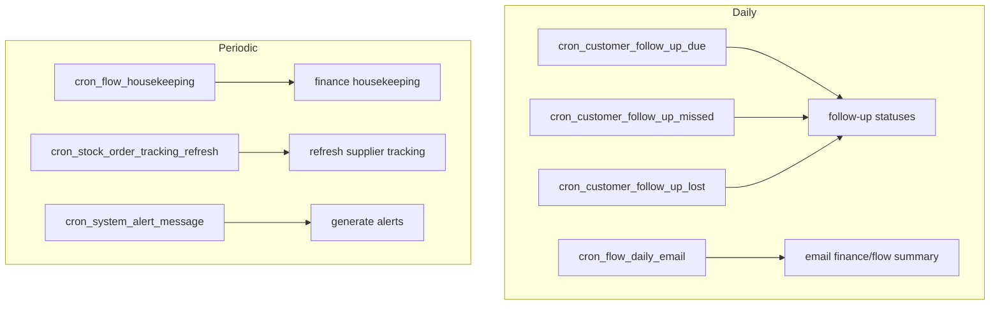

| Cron | Trigger | Reads/Writes | Effect |
|---|---|---|---|
| `cron_customer_follow_up_due.php` | daily | cms | mark follow-ups due |
| `cron_customer_follow_up_missed.php` | daily | cms | mark missed |
| `cron_customer_follow_up_lost.php` | daily | cms | mark lost |
| `cron_flow_daily_email.php` | daily | financial | email summary (`email_cc`) |
| `cron_flow_housekeeping.php` | periodic | financial | cleanup/maintenance |
| `cron_stock_order_tracking_refresh.php` | periodic | financial | refresh tracking |
| `cron_system_alert_message.php` | periodic | cms | create alert messages |

---

# Appendix — Conventions referenced / 约定速查

| Item | Value / meaning |
|---|---|
| Action codes | `I`=Insert, `E`=Edit, `V`=View, `D`=Delete (`$act_1/2/3` in `init.php`) |
| Soft delete | `status='D'` (never physically deleted; `getData` filters it out) |
| Audit fields | `create_by/date/time`, `update_by/date/time` on every table |
| Permission | `$currentPagePin` per page + `isActionAllowed(action, $pinAccess)` per button |
| Save handler | form POSTs to itself with `actionBtn=addData|updData|back` |
| Shared logic | PHP → `include/common.php`; JS → `js/common.fun.js` |
| Two DBs | `$connect` (cms) and `$finance_connect` (financial) |

---

*Process steps for Part B and the complex pages in Part C were verified against the actual source (login.php, brand.php, recordDelete.php, make_order.php, shopee_verify.php, warehouse_stock_in_scan.php, insert_table.php). The CRUD patterns in Part B apply to the full entity family; open a specific page if you need field-level detail. Mermaid diagrams render in VS Code preview / GitHub.*
